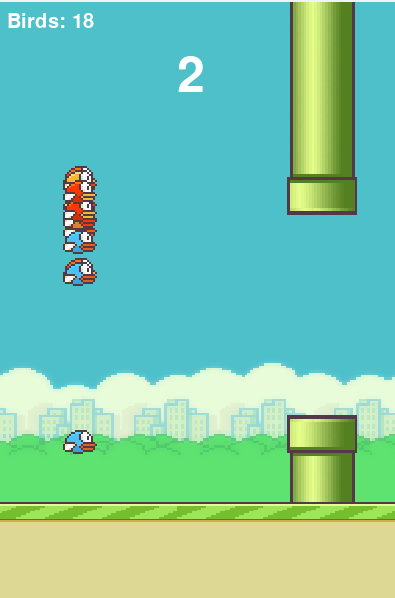

# NEAT Games AI

<p align="center">
  
    <video width="65%" height="5%" controls>
        <source src="docs/images/invertedpenimage.mp4" type="video/mp4">
        Your browser does not support the video tag.
    </video>
  <!-- Add more images here, e.g.:  -->
</p>

This project demonstrates the application of the **NEAT (NeuroEvolution of Augmenting Topologies)** algorithm to train AI agents to play simple games and simulations.

For more information on the algorithm, refer to the original paper: [Evolving Neural Networks through Augmenting Topologies](http://nn.cs.utexas.edu/downloads/papers/stanley.ec02.pdf) by Kenneth O. Stanley and Risto Miikkulainen.

## Projects Included

### 1. Flappy Bird AI
An AI agent learns to play a clone of the popular game Flappy Bird. The neural network controls the bird's flapping mechanism to navigate through pipes.

- **Location**: `FlappyBirdAi/`
- **Inputs**: Bird's Y position, distance to the next pipe, distance to the gap.
- **Outputs**: Jump (Flap).

### 2. Inverted Pendulum AI
An AI agent learns to balance an inverted pendulum on a moving cart. This is a classic control theory problem solved here using evolutionary neural networks.

- **Location**: `InvertedPendulumAi/`
- **Inputs**: Cart position, cart velocity, pendulum angle, pendulum angular velocity.
- **Outputs**: Move Left/Right.

## Installation

1. **Clone the repository**:
   ```bash
   git clone https://github.com/nikankad/NEAT-games.git
   cd NEAT-games
   ```

2. **Install dependencies**:
   It is recommended to use a virtual environment.
   ```bash
   pip install -r requirements.txt
   ```

   **Note on Graphviz**: To generate network visualizations, you need to have Graphviz installed on your system (not just the Python package).
   - **Windows**: Download and install from [Graphviz Download](https://graphviz.org/download/). Make sure to add Graphviz to your system PATH during installation.
   - **Linux**: `sudo apt-get install graphviz`
   - **Mac**: `brew install graphviz`

## Usage

Run the games from the root directory of the project to ensure file paths for configurations and assets are resolved correctly.

### Running Flappy Bird AI

```bash
python FlappyBirdAi/game/flappy.py
```

### Running Inverted Pendulum AI

```bash
python InvertedPendulumAi/game/pendulum.py
```

## Configuration

Each game has its own NEAT configuration file where you can tweak parameters such as population size, mutation rates, and fitness thresholds.

- **Flappy Bird**: `FlappyBirdAi/config-flappybird.txt`
- **Inverted Pendulum**: `InvertedPendulumAi/config-inverted-pendulum.txt`

## Visualization

The project includes a `utils/visualize.py` module that generates plots for:
- **Network Structure**: Visual representation of the neural network (nodes and connections).
- **Statistics**: Graphs showing average and best fitness over generations.

These visualizations are typically generated after the training loop completes or when a solution is found.
